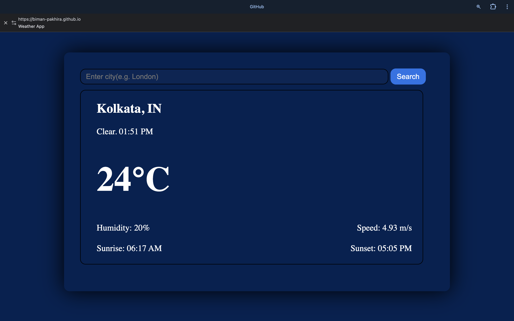

# Weather App 🌤️

A simple and elegant weather application that displays real-time weather information for any city around the world.

## Features ✨

- 🔍 Search weather by city name
- 🌡️ Display current temperature
- 💧 Show humidity levels
- 💨 Display wind speed
- 🌅 Sunrise and sunset times
- 🌦️ Current weather conditions (Mist, Clear, Clouds, etc.)
- ⏰ Real-time clock display

## Demo 🚀

To visit this project demo <a href="https://biman-pakhira.github.io/WeatherApp/">click here</a>

## Technologies Used 💻

- HTML5
- CSS3
- JavaScript (ES6+)
- OpenWeatherMap API

## How to Use 📖

1. Enter a city name in the search box (e.g., London, New York, Tokyo)
2. Click the "Search" button or press Enter
3. View the weather information including temperature, humidity, wind speed, and sunrise/sunset times

## Setup 🛠️

1. Clone this repository
```bash
git clone https://github.com/Biman-pakhira/WeatherApp.git
```

2. Navigate to the project directory
```bash
cd WeatherApp
```

3. Open `index.html` in your web browser

4. (Optional) Replace the API key in the `script.js` file with your own OpenWeatherMap API key:
```javascript
const apiKey = "your_api_key_here";
```

## API Reference 🔑

This project uses the [OpenWeatherMap API](https://openweathermap.org/api) to fetch weather data.

## Screenshots 📸



## Default City 🏙️

The app loads with Kolkata as the default city on page load.

## License 📄

This project is open source and available under the [MIT License](LICENSE).

## Author ✍️

Created by **Biman Pakhira**

## Acknowledgments 🙏

- Weather data provided by [OpenWeatherMap](https://openweathermap.org/)
